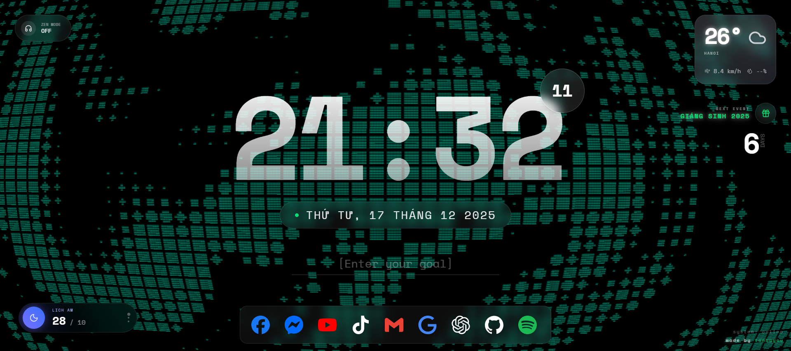

# Lịch Âm New Tab Extension

## Giới thiệu

Extension Chrome thay thế trang New Tab mặc định bằng giao diện đẹp mắt hiển thị:

- Giờ và Ngày Dương lịch.
- Ngày Âm lịch Việt Nam.
- Hình nền ngẫu nhiên chất lượng cao.

## Cách cài đặt (Developer Mode)

1. Mở Chrome, truy cập vào `chrome://extensions`.
2. Bật chế độ **Developer mode** (Góc trên bên phải).
3. Nhấn vào nút **Load unpacked**.
4. Chọn thư mục `c:\Users\ACER\licham\dist` (Lưu ý: Chọn thư mục `dist` sau khi đã build).
   - Nếu chưa thấy thư mục `dist`, hãy chạy lệnh `npm run build` trong thư mục dự án.

## Phát triển

- Chạy `npm run dev` để xem thử trên trình duyệt (Lưu ý: Chế độ dev không load như extension thật 100% về mặt API chrome, nhưng giao diện thì xem được).
- Chạy `npm run build` để đóng gói extension.

## Tech Stack

- React + Vite + TypeScript
- TailwindCSS v4
- lunar-date-vn (Lịch âm)
- date-fns (Xử lý ngày tháng)
