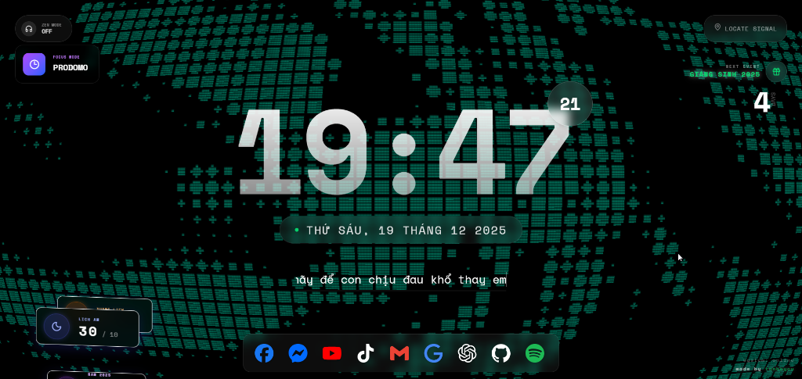
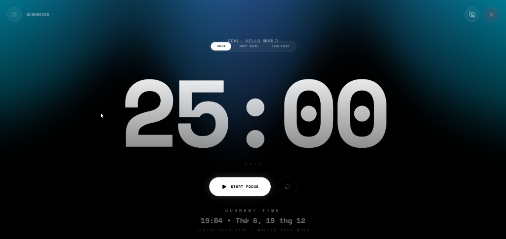

# Lịch Âm New Tab Extension

Cảm ơn bạn đã quan tâm đến dự án **Lịch Âm New Tab**! 🎉

Đây là một Chrome Extension giúp thay thế trang New Tab mặc định bằng một giao diện hiện đại, đậm chất Việt Nam.

## Tính năng nổi bật

- 🌕 **Lịch Âm Dương**: Xem ngày giờ dương lịch và âm lịch chi tiết ngay trên màn hình chính.
- 🌤️ **Thời tiết**: Cập nhật thông tin thời tiết địa phương theo thời gian thực (Nhiệt độ, độ ẩm, sức gió...).
- 🧘 **Zen Mode**: Chế độ tập trung, ẩn bớt các thành phần không cần thiết.
- 🔗 **Lối tắt**: Truy cập nhanh các trang web phổ biến (Facebook, Youtube, Gmail...).
- 🖼️ **Hình nền đẹp**: Tự động hiển thị hình nền chất lượng cao từ Unsplash.

## ✨ Tính năng Prodomo (New)

Chế độ **Prodomo** giúp bạn quản lý thời gian và sự tập trung hiệu quả hơn:

- ⏱️ **Focus Timer**: Đồng hồ đếm ngược theo phương pháp Pomodoro (Mặc định 25 phút).
- 🎯 **Goal Setting**: Đặt mục tiêu cụ thể cho phiên làm việc.
- 📊 **Dashboard**: Theo dõi trạng thái và thời gian hiện tại một cách trực quan.
- 🌡️ **Atmosphere**: Giao diện tối giản, tập trung vào công việc.

## Hướng dẫn cài đặt (Developer Mode)

1. Clone repo này về máy: `git clone https://github.com/tanbaycu/lich-am.git`
2. Tạo file `.env` từ file mẫu:
   - Copy file `.env.example` thành `.env`.
   - Điền API Key OpenWeatherMap của bạn vào dòng `VITE_OPENWEATHER_API_KEY=...`.
3. Cài đặt thư viện: `npm install`
4. Build dự án: `npm run build`
5. Cài vào Chrome:
   - Mở `chrome://extensions`.
   - Bật **Developer mode** (Góc phải trên).
   - Chọn **Load unpacked** -> trỏ tới thư mục `dist` vừa build.

## Tech Stack

- **Core**: React 18, TypeScript, Vite.
- **Styling**: TailwindCSS.
- **Libs**: `lunar-date-vn` (Lịch âm), `date-fns`, `axios`.

---

_Dự án được phát triển bởi [tanbaycu](https://github.com/tanbaycu)._
